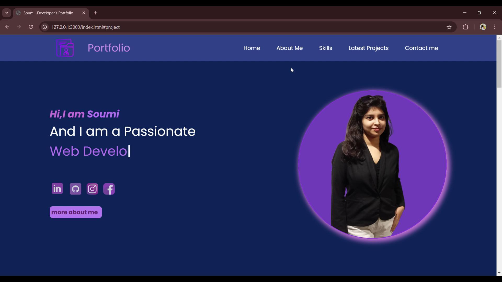

# 💼 Personal Portfolio Website

Welcome to my **Developer Portfolio**!  
This website showcases my skills, projects, certifications, and achievements as an aspiring Software Engineer and Full Stack Web Developer.

---

## 🌐 Live Demo

🔗 [View Portfolio Website](https://my-portfolio-delta-teal-10.vercel.app/)  

---

## 🧰 Tech Stack

- **HTML5** – Structure of the site  
- **CSS3** – Styling and layout  
- **JavaScript** – Dynamic functionality and interactions  
- **Responsive Design** – Mobile-first approach using media queries  
- **Vercel** – For deployment

---

## 📌 Features

- ✨ Clean, responsive user interface
- 🧑‍💼 About Me section with academic details
- 🛠 Skills showcase (Java, Web Dev, DBMS, etc.)
- 🧪 Projects with brief descriptions and technologies used
- 📜 Certifications
- 📞 Contact section with working links (email, GitHub, LinkedIn)

---

## 🖼 Preview

  

---
